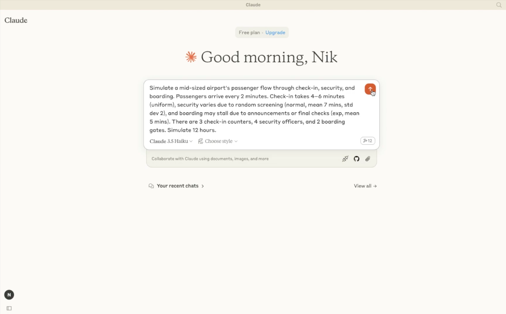

# **Text2Sim MCP Server**  
### *SimPy-based Discrete-Event Simulation Engine for LLM Integration*

**Text2Sim MCP Server** is a discrete-event simulation engine that generates and executes flexible SimPy-based models from natural language descriptions. It integrates with LLMs using the **Model Context Protocol (MCP)**, enabling powerful simulation capabilities within natural language environments like Claude Desktop.

[](https://www.youtube.com/embed/qkdV-HtTtLs "Text2Sim MCP Server (demo)")

---
## 🚀 Features

- **Large Language Model (LLM) Integration**  
  Create simulation models using plain English descriptions to LLMs.

- **Multi-Domain Support**  
  Build simulations for domains such as airport operations, healthcare, manufacturing, and more.

- **Configurable Entities**  
  Define custom entity attributes and behaviours.

- **Stochastic Process Logic**  
  Configure steps with a range of probability distributions (e.g., `uniform`, `normal`, `exponential`).

- **Real-Time Metrics**  
  Collect and analyse performance indicators such as wait times and throughput.

- **Secure Implementation**  
  Uses regex-based parsing (not `eval()`) for processing time distribution inputs.

---

## 🔧 Installation

### **Prerequisites**
- Python **3.12** or higher
- [`uv` package manager](https://github.com/astral-sh/uv)

### **Install `uv`**

#### On macOS and Linux:
```bash
curl -LsSf https://astral.sh/uv/install.sh | sh
```

#### On Windows (PowerShell):
```powershell
powershell -ExecutionPolicy ByPass -c "irm https://astral.sh/uv/install.ps1 | iex"
```

Learn more: [astral-sh/uv](https://github.com/astral-sh/uv)

---

## 🛠️ Usage

### **Clone the repository**
```bash
git clone https://github.com/IamCatoBot/text2sim-MCP-server.git
```

### **Integration with Claude Desktop**

1. Open:
 
`Claude > Settings > Developer > Edit Config > claude_desktop_config.json`

2. Add the following block:
```json
{
  "mcpServers": {
    "Text2Sim MCP Server": {
      "command": "uv",
      "args": [
        "--directory",
        "PATH_TO_TEXT2SIM_MCP_SERVER", 
        "run",
        "mcp_server.py"
      ],
      "env": {}
    }
  }
}
```

> **Note:** If the `uv` command is not found, run `which uv` (Unix) or `Get-Command uv` (PowerShell) and use the full path in the `"command"` field.

---

## 📚 API Reference

### Overview

The `simulate_des` function expects a configuration dictionary describing the simulation setup. When using a Large Language Model (e.g. Claude) client, natural language prompts are translated into this dictionary via the **Model Context Protocol (MCP)**.

---

### 🔠 Configuration Schema

The full config follows this structure:

```json
{
  "interarrival": 3,
  "num_entities": 100,
  "run_time": 120,
  "steps": [
    {
      "name": "step_name",
      "capacity": 2,
      "distribution": "exp(4)",
      "description": "optional natural-language annotation"
    }
  ]
}
```

---

### 🎲 Supported Distributions

Use these in the `distribution` field of any step:

| Format | Description | Example |
|--------|-------------|---------|
| `"uniform(min, max)"` | Uniform between `min` and `max` | `"uniform(1, 3)"` |
| `"normal(mean, std)"` or `"gauss(mean, std)"` | Normal/Gaussian distribution | `"normal(5, 2)"` |
| `"exp(mean)"` | Exponential distribution with mean | `"exp(4)"` |

> All distributions are parsed using regex. No unsafe code evaluation occurs.

---

### 📈 Returned Metrics

Each simulation returns a dictionary of performance metrics:

- `{step_name}_wait_time_avg`: Average wait time at this step  
- `{step_name}_completed_count`: Number of entities that completed this step

#### Example Output:
```json
{
  "check_in_wait_time_avg": 2.1,
  "check_in_completed_count": 100,
  "boarding_wait_time_avg": 1.8,
  "boarding_completed_count": 100
}
```

---

### ✍️ Prompting Guide:

Here’s how to structure prompts that result in effective simulations:

#### 🧠 Prompt Components

| Concept | What to Say |
|--------|--------------|
| **Process steps** | Use terms like *check-in*, *triage*, *screening* |
| **Capacities** | Mention staffing levels or number of stations |
| **Process durations** | Say things like *takes 5–10 minutes*, *around 6 minutes on average* |
| **Arrival rate** | Use phrases like *one every 2 minutes*, *roughly every 5 minutes* |
| **Simulation length** | *Simulate 12 hours*, *simulate 300 patients* |

---

#### ✅ Prompt Example:

> *“Simulate a small hospital with triage, diagnosis, and treatment. Triage takes 3–5 minutes, diagnosis around 10 minutes, and treatment about 20. There are two triage nurses, three doctors, and one treatment bed. Patients arrive every 6 minutes. Simulate 8 hours or 80 patients.”*

Will generate:
```json
{
  "interarrival": 6,
  "num_entities": 80,
  "run_time": 480,
  "steps": [
    {
      "name": "triage",
      "capacity": 2,
      "distribution": "uniform(3, 5)",
      "description": "Initial nurse triage"
    },
    {
      "name": "diagnosis",
      "capacity": 3,
      "distribution": "normal(10, 2)",
      "description": "Doctor diagnosis process"
    },
    {
      "name": "treatment",
      "capacity": 1,
      "distribution": "normal(20, 5)",
      "description": "Patient treatment"
    }
  ]
}
```

---

## 💡 Example

### Prompt:
> *“Simulate passenger processing in a small airport with check-in, security screening, and boarding. Assume moderate staffing and that passengers arrive roughly every 3 minutes. Simulate 16 hours and 320 passengers.”*

### Claude Desktop converts this into:
```json
{
  "config": {
    "steps": [
      {
        "name": "check_in",
        "capacity": 4,
        "description": "Passenger check-in process with multiple counters",
        "distribution": "normal(5, 2)"
      },
      {
        "name": "security_screening",
        "capacity": 3,
        "description": "Security checkpoint with multiple lanes",
        "distribution": "normal(8, 3)"
      },
      {
        "name": "boarding",
        "capacity": 2,
        "description": "Boarding gate processing",
        "distribution": "normal(6, 2)"
      }
    ],
    "run_time": 960,
    "interarrival": 3,
    "num_entities": 320
  }
}
```

The Text2Sim Discete-event Simulation (DES) engine parses this config, runs a SimPy-based simulation, and returns metrics for interpretation.

---

## 🏗️ Architecture

Text2Sim is structured into modular components:

- **MCP Server** – Handles natural language requests via MCP.
- **Simulation Model** – Core [SimPy](https://simpy.readthedocs.io/en/latest/) engine that executes process flows.
- **Entity Class** – Represents units flowing through the system.
- **Process Steps** – Encapsulate logic for each process stage.
- **Metrics Collector** – Gathers statistics like wait times and throughput.
- **Secure Distribution Parser** – Parses probability distributions safely.

---

## 🔐 Security Considerations

- **No `eval()` usage**  
  Regex-based parsing prevents arbitrary code execution.
  
- **Input Validation**  
  Distribution types and parameters are validated before execution.

- **Robust Error Handling**  
  Errors are reported cleanly without leaking internal state.

---

## 🤝 Contributing

Pull requests are welcome! Please fork the repo and submit a PR. Suggestions, bug reports, and feature ideas are always appreciated.

---

## 📄 License

This project is licensed under the **MIT License**. See the [LICENSE](LICENSE.txt) file for details.